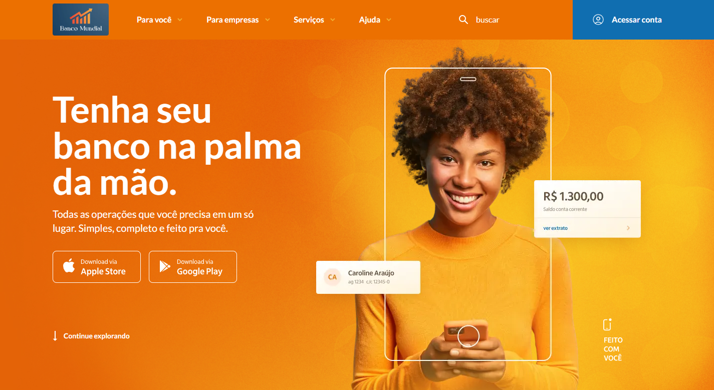
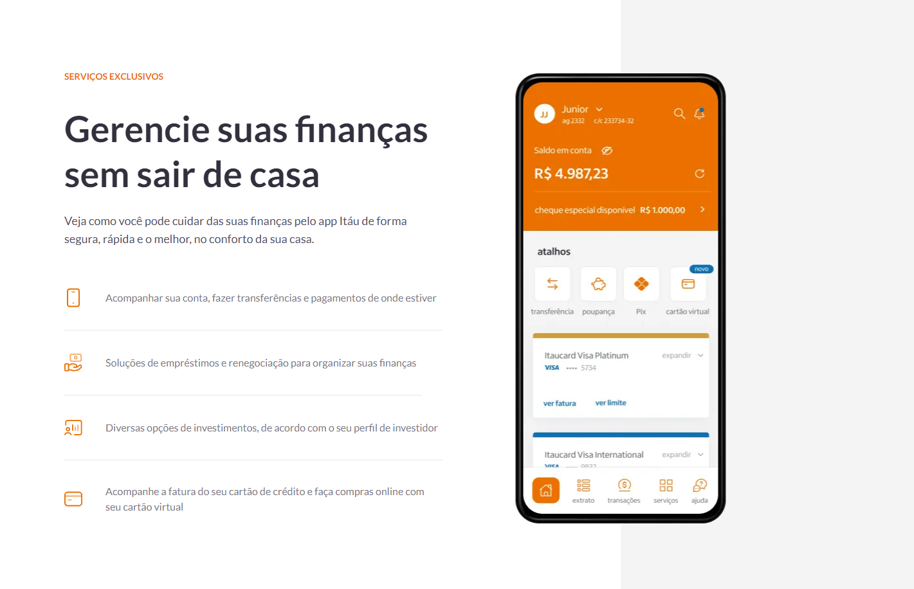

# Página Inicial do Banco Mundial

Este é um projeto pessoal que consiste na criação da página inicial de um website fictício chamado "Banco Mundial". O objetivo deste projeto é demonstrar minhas habilidades de desenvolvimento web usando as tecnologias React.js, Next.js e Tailwind CSS.

# Visão Geral do Projeto

A página inicial do "Banco Mundial" é uma representação fictícia de um banco internacional. Ela inclui informações e recursos importantes para os clientes em potencial, como:

- Visão geral do banco.
- Produtos e serviços oferecidos.
- Informações e links para recursos adicionais

# Tecnologias Utilizadas

Este projeto foi desenvolvido usando as seguintes tecnologias:

- React.js: Uma biblioteca JavaScript popular para a criação de interfaces de usuário interativas.
- Next.js: Um framework React.js que permite a renderização do lado do servidor e otimização de desempenho.
- Tailwind CSS: Um framework CSS utilitário que simplifica o design e a estilização de componentes.

# Pré-requisitos

Certifique-se de ter as seguintes ferramentas instaladas em sua máquina antes de executar o projeto:

- Node.Js

# Instalação

1 - Clone este repositório para o seu computador local usando
2 - Instale as dependencias do projeto com o comando "npm install"

# Executando o Projeto

1 - Depois de concluir a instalação, você pode iniciar o projeto localmente. Use o seguinte comando "npm run dev".

2 - Isso iniciará o servidor de desenvolvimento e você poderá acessar a página inicial do "Banco Mundial" em http://localhost:3000.

# Contribuindo

Se você deseja contribuir para este projeto, sinta-se à vontade para abrir um pedido de pull request. Ficarei feliz em analisar suas sugestões e melhorias.

# Contato

Se você tiver alguma dúvida ou precisar de assistência, entre em contato comigo em crisoenning@gmail.com.
